# CommaMatrix Visual Flows

## 1. Hook Invocation Flow

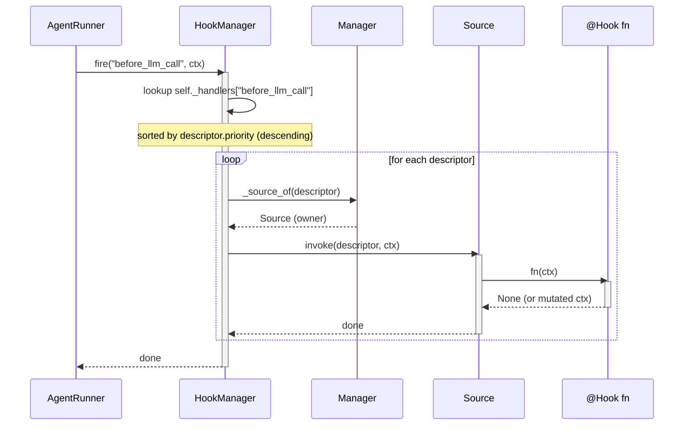

---

## 2. Tool Invocation (without CodeAct)

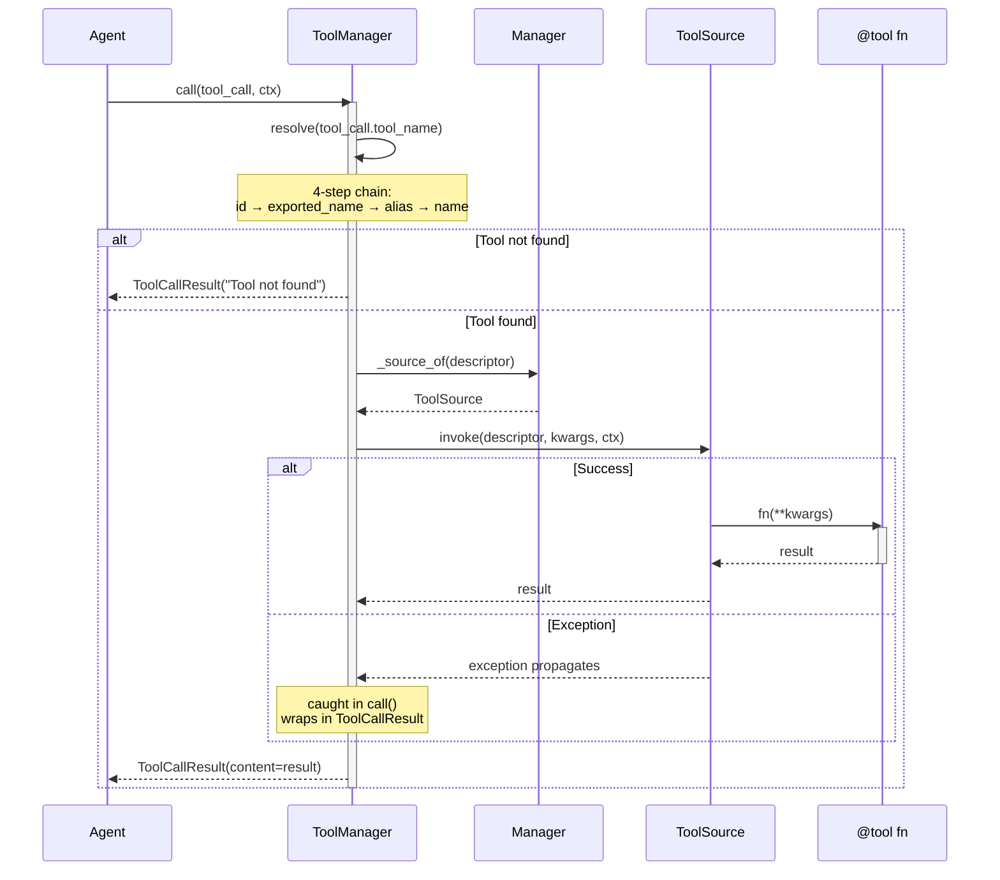

---

## 3. Tool Invocation (with CodeAct)

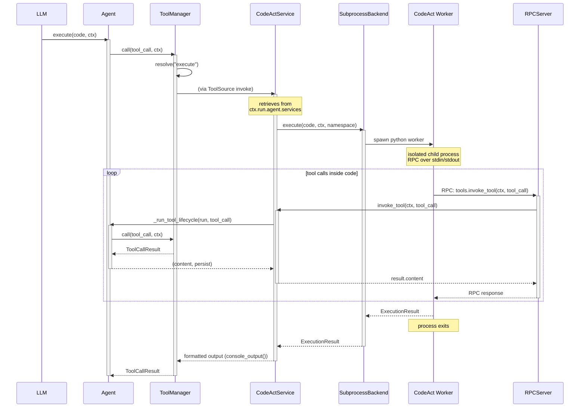

---

## 4. Connector Event Listening

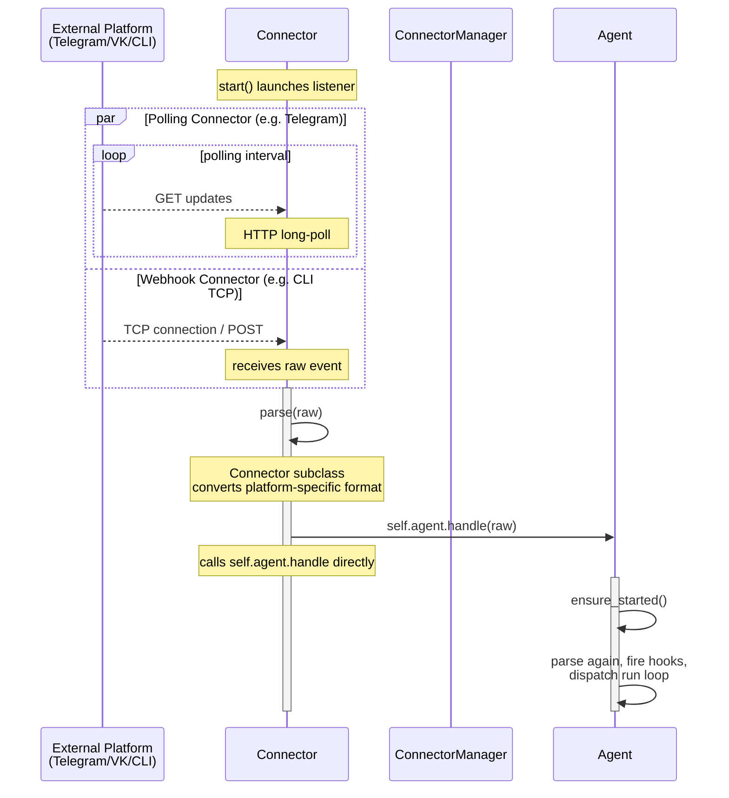

---

## 5. External Event via `agent.handle()`

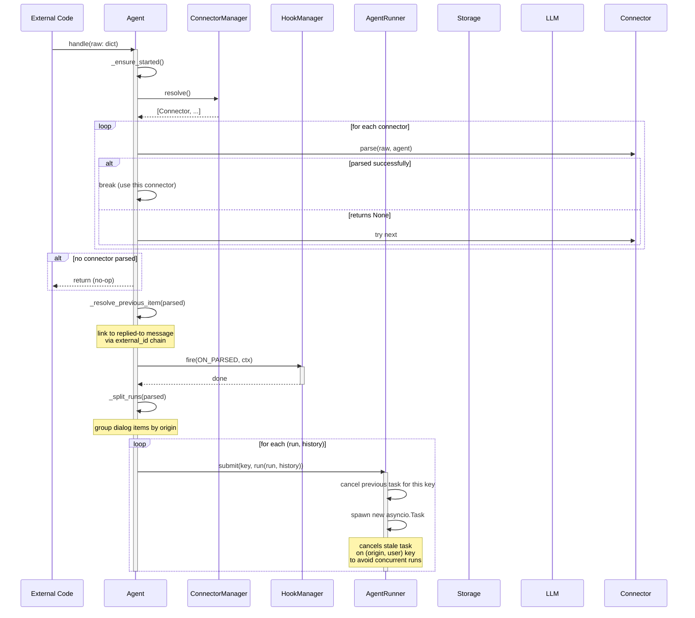

---

## 6. Agent Startup (Default Settings)

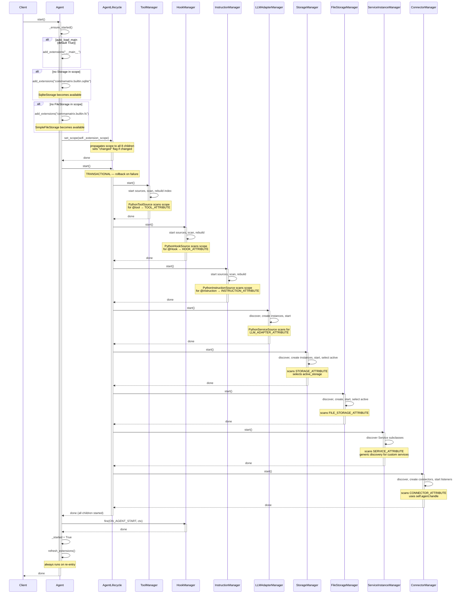

---

## 7. Agent Shutdown (Default Settings)

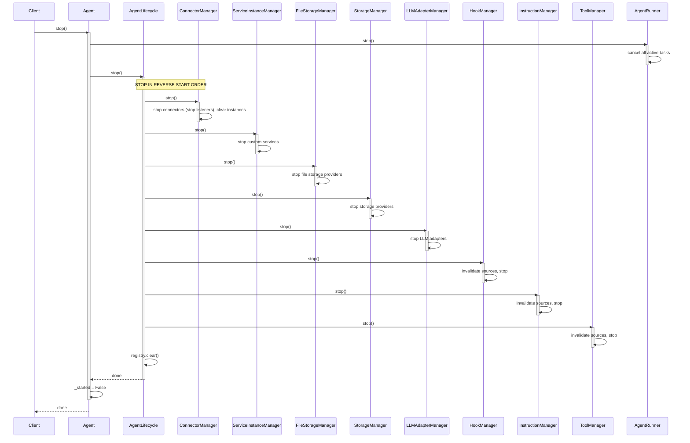

---

## 8. `refresh()` Chain with Fingerprint Checks

### 8a. AgentLifecycle.refresh()

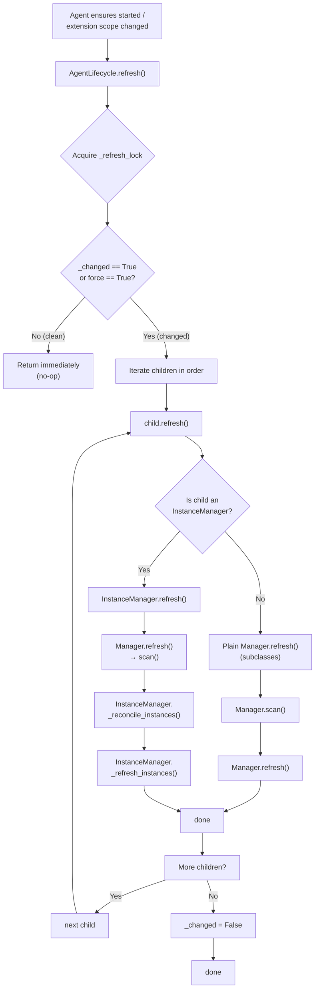

### 8b. Manager.scan() — Fingerprint Check Detail

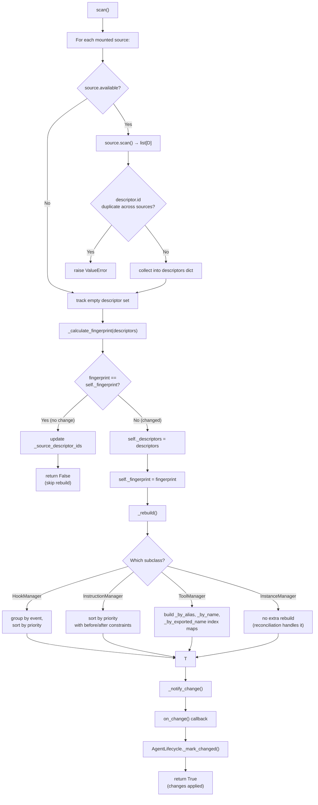

### 8c. InstanceManager._reconcile_instances() — Instance AgentLifecycle

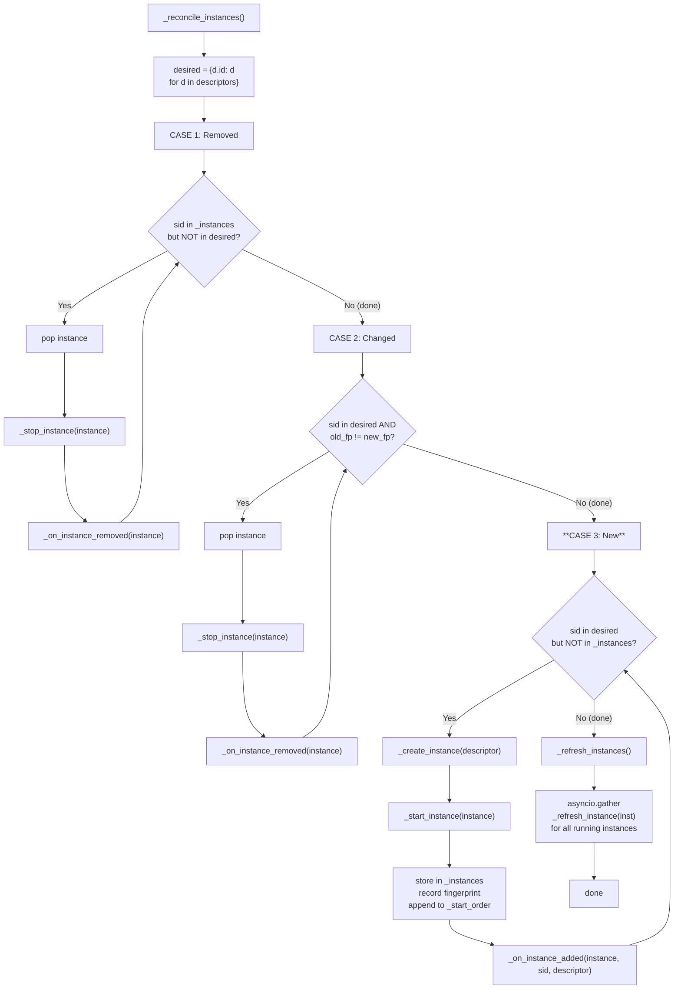

---

## 9. Manager & Service Inheritance

### Part A — AbstractService → Manager Hierarchy

```mermaid
classDiagram
    class AbstractService {
        «ABC»
        + agent: Agent
        + __init__(agent: Agent)
        + start() async … initialize resources
        + stop() async … release resources
        + refresh() async … sync with extensions
    }

    class Service {
        «ABC»
        + __init_subclass__() → stamps SERVICE_ATTRIBUTE
        ──────────────────────────────────
        Inherits: start, stop, refresh
        Adds: auto-discovery via SERVICE_ATTRIBUTE
    }
    AbstractService <|-- Service : extends

    class Storage {
        + __init_subclass__() → stamps STORAGE_ATTRIBUTE
        + save_event(entry) async → int | None
        + get_branch(last_item_id) async → list[DialogItem]
        + find_item_id_by_external_id(eid, origin) async → int | None
    }
    AbstractService <|-- Storage : extends (no SERVICE_ATTRIBUTE)

    class FileStorage {
        + __init_subclass__() → stamps FILE_STORAGE_ATTRIBUTE
        + save(data, ext) async → str
        + get(file_id) async → bytes | None
        + delete(file_id) async → bool
    }
    AbstractService <|-- FileStorage : extends (no SERVICE_ATTRIBUTE)

    class LLMAdapter {
        + __init_subclass__() → stamps LLM_ADAPTER_ATTRIBUTE
        + ask_llm(ctx) async → LLMResponse
    }
    AbstractService <|-- LLMAdapter : extends (no SERVICE_ATTRIBUTE)

    class Connector {
        + origin_types: ClassVar[tuple[type[DialogOrigin], ...]]
        + __init_subclass__() → stamps CONNECTOR_ATTRIBUTE
        + start() async … launches listener
        + stop() async … cancels listener
        + parse(raw, agent) async → OnParsedCtx | None
        + send(origin, item) async → str
        + typing(origin) → AsyncIterator
        + listen(on_event) async … platform loop
    }
    AbstractService <|-- Connector : extends (no SERVICE_ATTRIBUTE)

    class Manager~D~ {
        «Generic[D: Descriptor]»
        # _sources: list[Source[D]]
        # _descriptors: dict[str, D]
        # _fingerprint: str | None
        + on_change: Callable | None
        + start() async → refresh at end
        + stop() async → invalidate sources
        + refresh() async → scan()
        + mount(source)
        + unmount(source)
        + scan() → bool … fingerprint-based
        + invalidate(source) → bool
    }
    AbstractService <|-- Manager : extends

    class ToolManager {
        + call(tool_call, ctx) async → ToolCallResult
        + resolve(name) → ToolDescriptor
        + schemas() → list[dict]
        + invoke(tool_call) async → Any
        ──────────────────────────────────
        Inherits: mount, scan, invalidate, fingerprint check
        Adds: alias/name/exported_name index maps
    }
    Manager <|-- ToolManager : extends

    class HookManager {
        - _handlers: dict[str, list[HookDescriptor]]
        + fire(event, ctx) async … priority order
        ──────────────────────────────────
        Inherits: mount, scan, invalidate
        Adds: event-grouped, priority-sorted handler map
    }
    Manager <|-- HookManager : extends

    class InstructionManager {
        - _ordered: list[InstructionDescriptor]
        + collect(run) async → list[str]
        + set_scope(scope)
        ──────────────────────────────────
        Inherits: mount, scan, invalidate
        Adds: ordered instruction collection with before/after constraints
    }
    Manager <|-- InstructionManager : extends

    class InstanceManager~D,I~ {
        «Generic — I: AbstractService»
        # _instances: dict[str, I]
        # _start_order: list[str]
        + instances → list[I]
        # _create_instance(descriptor) → I
        # _start_instance(instance) async
        # _stop_instance(instance) async
        # _refresh_instance(instance) async
        # _on_instance_added(instance, sid, descriptor)
        # _on_instance_removed(instance)
        # _reconcile_instances()
        # _refresh_instances() async
        ──────────────────────────────────
        Inherits: mount, scan, fingerprint, invalidate
        Adds: instance create/start/stop/reconcile lifecycle
    }
    Manager <|-- InstanceManager : extends

    class ServiceInstanceManager {
        # base_type: type[AbstractService]
        # marker_attribute: str
        # id_prefix: str
        ──────────────────────────────────
        Inherits: instance lifecycle
        Adds: creates via service_cls(agent), registry hooks, class-var source defaults
    }
    InstanceManager <|-- ServiceInstanceManager : D=ServiceDescriptor, I=AbstractService

    class ActiveServiceInstanceManager {
        «abstract — subclass must set base_type, marker_attribute, active_field»
        # base_type: type[AbstractService]
        # marker_attribute: str
        # id_prefix: str
        # active_field: ConfigField[str | None]
        - _active_id: str | None
        + _active → instance (property)
        # _select_active() … picks configured or first
        ──────────────────────────────────
        Inherits: instance lifecycle + registry hooks
        Adds: active-instance selection by config or “first”
    }
    ServiceInstanceManager <|-- ActiveServiceInstanceManager : extends

    class StorageManager {
        ──────────────────────────────────
        Inherits: active selection
        Adds: delegates save_event/get_branch/find → active Storage
    }
    ActiveServiceInstanceManager <|-- StorageManager : base_type=Storage, marker_attribute=STORAGE_ATTRIBUTE

    class FileStorageManager {
        ──────────────────────────────────
        Inherits: active selection
        Adds: delegates save/get/delete → active FileStorage
    }
    ActiveServiceInstanceManager <|-- FileStorageManager : base_type=FileStorage, marker_attribute=FILE_STORAGE_ATTRIBUTE

    class LLMAdapterManager {
        ──────────────────────────────────
        Inherits: instance lifecycle (NOT active selection)
        Adds: first-adapter pattern — forwards ask_llm → first instance
    }
    ServiceInstanceManager <|-- LLMAdapterManager : extends (skips active selection)

    class ConnectorManager {
        + resolve() → list[Connector]
        ──────────────────────────────────
        Inherits: instance lifecycle
        Adds: wires self.agent.handle
    }
    ServiceInstanceManager <|-- ConnectorManager : extends (scans CONNECTOR_ATTRIBUTE)

    class AgentLifecycle {
        «root composite — NOT an AbstractService»
        - _children: list[Manager]
        - _changed: bool
        - _registry: ServiceInstanceRegistry
        + registry → ServiceInstanceRegistry
        + get_manager(cls) → Manager | None
        + start() async … transactional, rollback on fail
        + stop() async … reverse order
        + refresh(force) async … no-op when clean
        + set_scope(scope) … propagates to all children
    }

    AgentLifecycle o--> ToolManager : owns
    AgentLifecycle o--> HookManager : owns
    AgentLifecycle o--> InstructionManager : owns
    AgentLifecycle o--> LLMAdapterManager : owns
    AgentLifecycle o--> StorageManager : owns
    AgentLifecycle o--> FileStorageManager : owns
    AgentLifecycle o--> ServiceInstanceManager : owns (generic, custom Service discovery)
    AgentLifecycle o--> ConnectorManager : owns

    class ServiceInstanceRegistry {
        + get(key: type[T]) → T | None
        + require(key: type[T]) → T
        + get_by_id(descriptor_id) → object | None
        + get_all(base: type[T]) → list[T]
        + remove_by_instance(instance)
        + clear()
    }
    AgentLifecycle *--> ServiceInstanceRegistry : creates & owns
    ServiceInstanceManager --> ServiceInstanceRegistry : registers instances
```

**What each level inherits:**

| Level | Inherits from | Key inherited capabilities |
|-------|--------------|---------------------------|
| `Service` | `AbstractService` | `start()` / `stop()` / `refresh()` lifecycle + stamps `SERVICE_ATTRIBUTE` |
| `Storage`, `FileStorage`, `LLMAdapter` | `AbstractService` | `start()` / `stop()` / `refresh()` + stamps own provider marker |
| `Connector` | `AbstractService` | `start()` (launches listener) / `stop()` (cancels) + stamps `CONNECTOR_ATTRIBUTE` |
| `Manager[D]` | `AbstractService` | source mounting, fingerprint-based `scan()`, invalidation, `start()`→refresh (core/base/manager.py) |
| `ToolManager` | `Manager` | name-resolution index maps, `call()` / `resolve()` / `schemas()` |
| `HookManager` | `Manager` | event-grouped handler map, priority-ordered `fire()` |
| `InstructionManager` | `Manager` | ordered instruction collection, `collect()` → system prompt fragments |
| `InstanceManager[D,I]` | `Manager` | instance create/start/stop/reconcile lifecycle + refresh |
| `ServiceInstanceManager` | `InstanceManager` | *Binds D=ServiceDescriptor I=AbstractService*; integrates with `ServiceInstanceRegistry` |
| `ActiveServiceInstanceManager` | `ServiceInstanceManager` | active-instance selection (`_select_active()`) by config or first-available |
| `StorageManager` | `ActiveServiceInstanceManager` | delegates to active `Storage` |
| `FileStorageManager` | `ActiveServiceInstanceManager` | delegates to active `FileStorage` |
| `LLMAdapterManager` | `ServiceInstanceManager` | first-adapter pattern (no active selection) |
| `ServiceInstanceManager` (generic) | `ServiceInstanceManager` | discovers custom `Service` subclasses (default params) |
| `ConnectorManager` | `ServiceInstanceManager` | wires `agent.handle`, `resolve()` returns connectors |

---

### Part B — Source & Descriptor Hierarchy

```mermaid
classDiagram
    class Source~D~ {
        «ABC — Generic[D: Descriptor]»
        «core/base/source.py»
        # _invalidation_callbacks: list
        # _available: bool
        + available → bool (property)
        + scan() → Iterable[D] (abstract)
        + start() async
        + stop() async
        + invalidate() … sets available=False, fires callbacks
        + restore() … sets available=True
    }

    class ToolSource {
        «components/tool.py»
        + invoke(descriptor, kwargs, ctx) async → object
    }
    Source <|-- ToolSource : extends (binds D=ToolDescriptor)

    class PythonSource~D~ {
        «core/base/source.py»
        - _scope: list[str]
        + set_scope(scope)
        ──────────────────────────────────
        Inherits: scan, invalidate, restore, available
        Adds: modules scope, identity filtering via __module__
    }
    Source <|-- PythonSource : extends

    class PythonToolSource {
        «components/tool.py»
        ──────────────────────────────────
        Scopes: modules with @tool → TOOL_ATTRIBUTE
    }
    PythonSource <|-- PythonToolSource : D=ToolDescriptor

    class PythonHookSource {
        «components/hook.py»
        ──────────────────────────────────
        Scopes: modules with @Hook → HOOK_ATTRIBUTE
    }
    PythonSource <|-- PythonHookSource : D=HookDescriptor

    class PythonInstructionSource {
        «components/instruction.py»
        ──────────────────────────────────
        Scopes: modules with @instruction → INSTRUCTION_ATTRIBUTE
    }
    PythonSource <|-- PythonInstructionSource : D=InstructionDescriptor

    class PythonConnectorSource {
        «components/connector.py»
        ──────────────────────────────────
        Scopes: modules with Connector subclasses → CONNECTOR_ATTRIBUTE
    }
    PythonSource <|-- PythonConnectorSource : D=ConnectorDescriptor

    class PythonServiceSource {
        «core/base/source.py»
        ──────────────────────────────────
        Unified service source. Defaults to SERVICE_ATTRIBUTE/AbstractService/"service".
        Accepts base_type, marker_attribute, id_prefix for provider slots.
    }
    PythonSource <|-- PythonServiceSource : D=ServiceDescriptor

    class Descriptor {
        «core/base/descriptor.py»
        «frozen dataclass»
        + id: str
        + _source_ref: weakref
        + fingerprint → str (property)
        ──────────────────────────────────
        SHA-256(fingerprint_payload) → change detection
    }

    class ToolDescriptor {
        «components/tool.py»
        + namespace: str
        + alias: str
        + name: str
        + exported_name: str
        + doc: str
        + schema: dict
        + metadata: dict
    }
    Descriptor <|-- ToolDescriptor

    class HookDescriptor {
        «components/hook.py»
        + event: str
        + priority: int
        + metadata: dict
    }
    Descriptor <|-- HookDescriptor

    class InstructionDescriptor {
        «components/instruction.py»
        + name: str
        + module: str
        + priority: int
        + before: tuple[str, ...]
        + after: tuple[str, ...]
    }
    Descriptor <|-- InstructionDescriptor

    class ServiceDescriptor {
        «core/base/service.py»
        + service_cls: type[AbstractService]
        + metadata: dict
    }
    Descriptor <|-- ServiceDescriptor

    class ConnectorDescriptor {
        «components/connector.py»
        + connector_cls: type[Connector]
    }
    ServiceDescriptor <|-- ConnectorDescriptor
```

**How descriptors & sources connect:**

```
PythonToolSource      (components/tool.py)      ──scan()──▶ ToolDescriptor       ──▶ ToolManager indexes
PythonHookSource      (components/hook.py)      ──scan()──▶ HookDescriptor       ──▶ HookManager groups by event
PythonInstructionSource (components/instruction.py) ──scan()──▶ InstructionDescriptor ──▶ InstructionManager ordered list
PythonConnectorSource (components/connector.py)  ──scan()──▶ ConnectorDescriptor  ──▶ ConnectorManager creates instances
PythonServiceSource   (core/base/source.py)     ──scan()──▶ ServiceDescriptor    ──▶ ServiceInstanceManager / StorageManager / FileStorageManager / LLMAdapterManager
```

Each source is mounted into an `Manager` subclass. The manager calls `source.scan()` which produces descriptors. The manager's `_rebuild()` then builds specialized indexes (event→handlers map, alias→name→descriptor maps, instance reconciliation sets).

```
ToolManager  ──mount(PythonToolSource)──▶ PythonToolSource (components/tool.py) ──scan()──▶ [ToolDescriptor, ...]
HookManager  ──mount(PythonHookSource)──▶ PythonHookSource (components/hook.py) ──scan()──▶ [HookDescriptor, ...]
InstructionManager ──mount(PythonInstructionSource)──▶ PythonInstructionSource (components/instruction.py) ──scan()──▶ [InstructionDescriptor, ...]
```

Each `Source` tracks its own `available` flag. When a source is invalidated (e.g. module removed from scope), its descriptors are removed from the manager, triggering index rebuild and `on_change` notification.

---

## 9. Agent Run Loop — Response Processing

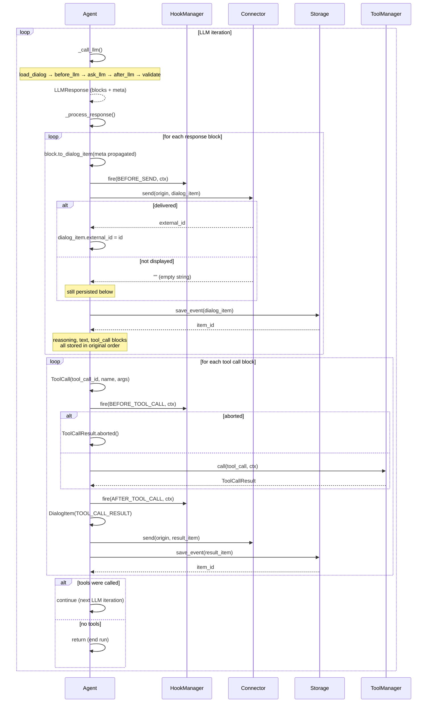

Key differences from the previous flow:
- Every response block (reasoning, text, tool_call) is **sent through the connector** — the connector decides what to render.
- All blocks are **persisted in order** before any tool executes.
- Tool results also pass through the connector.
- Provider-specific metadata (`meta["llm"]`) is preserved across send/store cycles.
