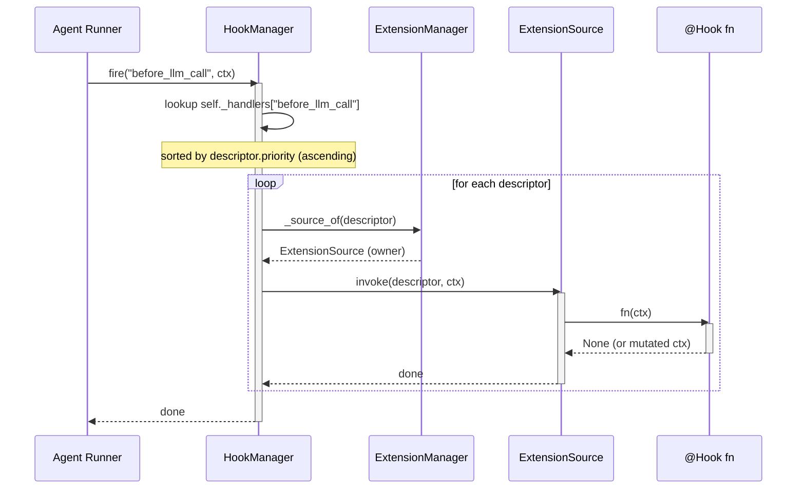
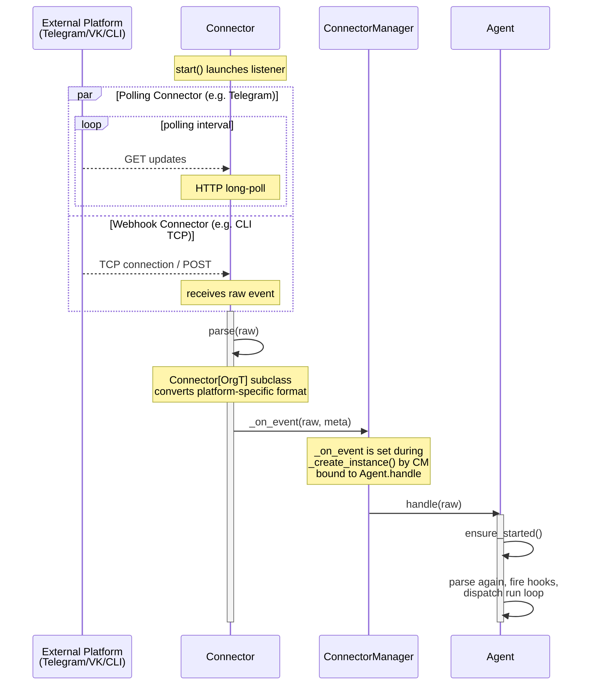
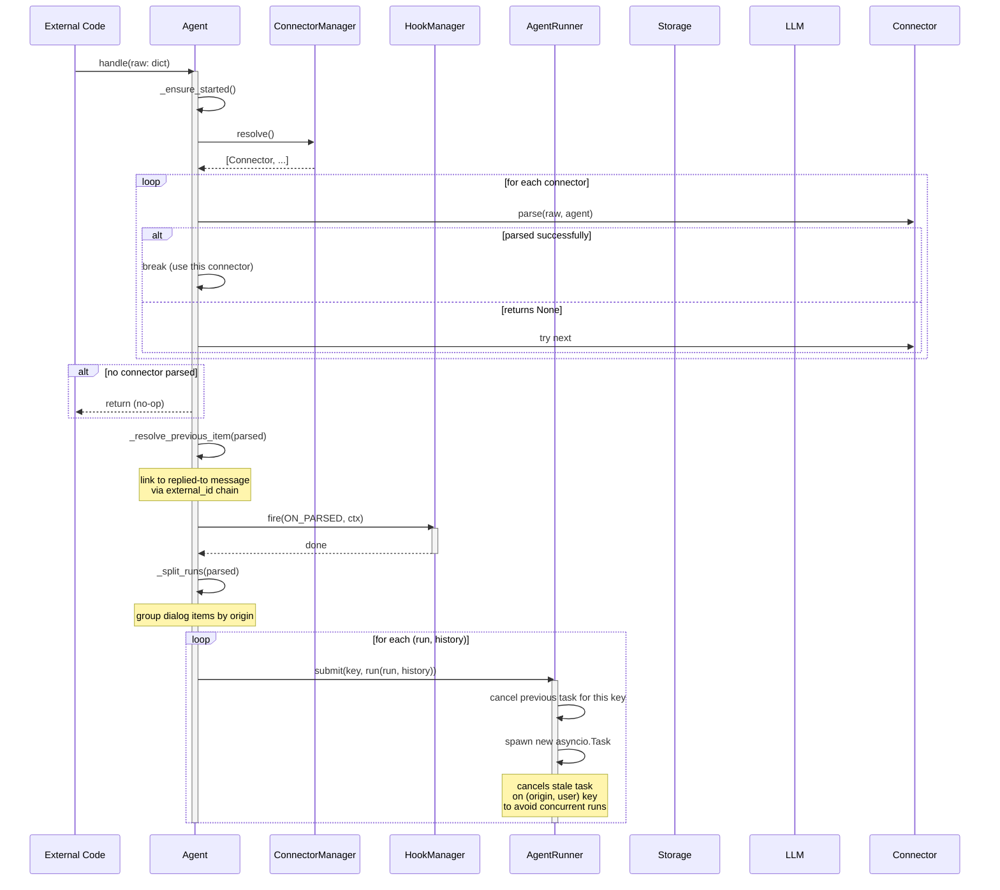
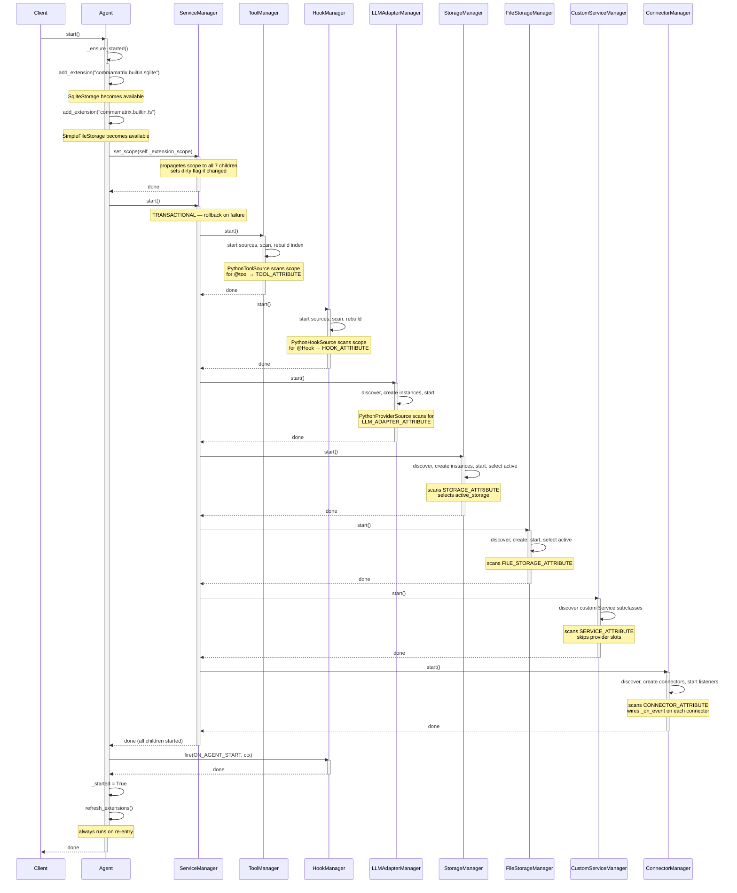
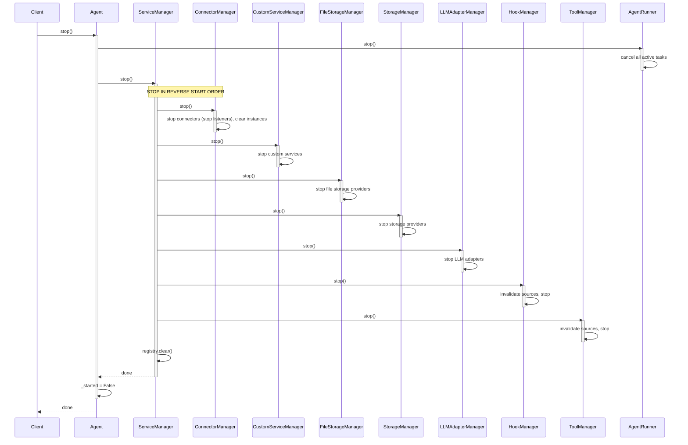
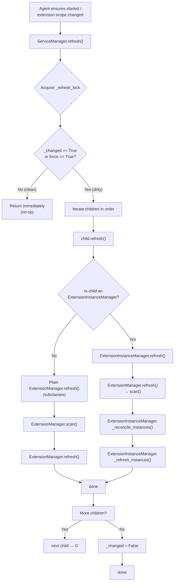
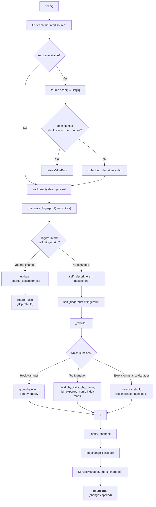
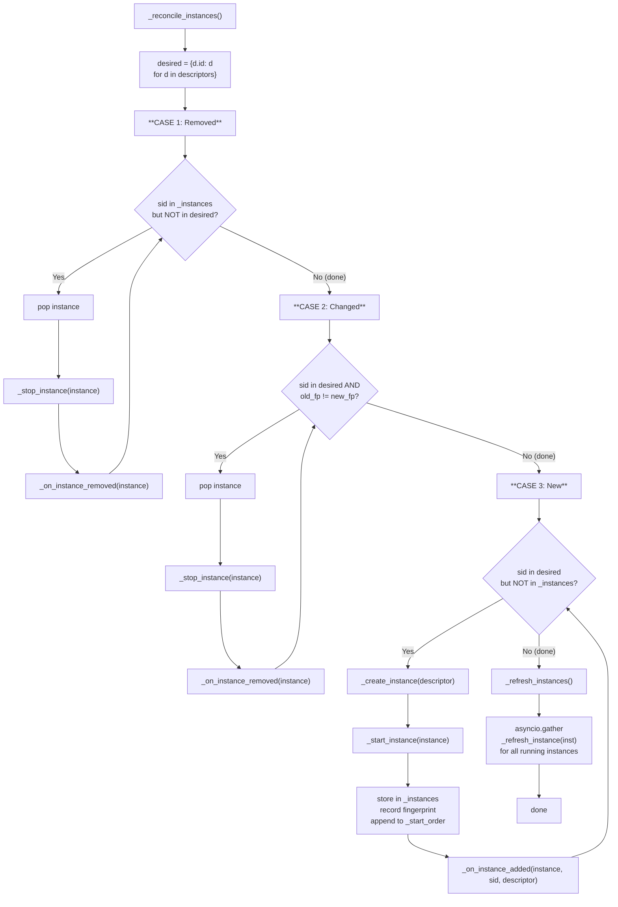

# CommaMatrix Visual Flows

## 1. Hook Invocation Flow



---

## 2. Tool Invocation (without CodeAct)

```mermaid
sequenceDiagram
    participant Agent
    participant TM as ToolManager
    participant ExtMgr as ExtensionManager
    participant Source as ToolSource
    participant Fn as @tool fn

    Agent->>TM: call(tool_call, ctx)
    activate TM

    TM->>TM: resolve(tool_call.tool_name)
    Note over TM: 4-step chain:<br/>id → exported_name → alias → name

    alt Tool not found
        TM-->>Agent: ToolCallResult("Tool not found")
    else Tool found
        TM->>ExtMgr: _source_of(descriptor)
        ExtMgr-->>TM: ToolSource
        TM->>Source: invoke(descriptor, kwargs, ctx)

        try
            Source->>Fn: fn(**kwargs)
            activate Fn
            Fn-->>Source: result
            deactivate Fn
            Source-->>TM: result
        catch Exception as exc
            Source-->>TM: raise
            TM-->>Agent: ToolCallResult("Error: ...")
        end

        TM-->>Agent: ToolCallResult(content=result)
    end

    deactivate TM
```

---

## 3. Tool Invocation (with CodeAct)

```mermaid
sequenceDiagram
    participant LLM
    participant Agent
    participant TM as ToolManager
    participant CodeActMgr as CodeActManager
    participant Backend as SubprocessBackend
    participant Worker as CodeAct Worker
    participant RPCServer

    LLM->>Agent: execute(code, ctx)
    activate Agent

    Agent->>TM: call(tool_call, ctx)
    activate TM
    TM->>TM: resolve("execute")

    TM->>CodeActMgr: (via ToolSource invoke)
    activate CodeActMgr
    Note over CodeActMgr: retrieves from<br/>ctx.run.agent.services

    CodeActMgr->>Backend: execute(code, ctx, namespace)
    activate Backend

    Backend->>Worker: spawn python worker
    Note over Worker: isolated child process<br/>RPC over stdin/stdout

    loop tool calls inside code
        Worker->>RPCServer: RPC: tools.invoke_tool(ctx, tool_call)
        activate RPCServer
        RPCServer->>CodeActMgr: invoke_tool(ctx, tool_call)
        activate CodeActMgr
        CodeActMgr->>Agent: _run_tool_lifecycle(run, tool_call)
        activate Agent

        Agent->>TM: call(tool_call, ctx)
        TM-->>Agent: ToolCallResult

        Agent-->>CodeActMgr: (content, persist)
        deactivate Agent
        CodeActMgr-->>RPCServer: result.content
        deactivate CodeActMgr
        RPCServer-->>Worker: RPC response
        deactivate RPCServer
    end

    Worker-->>Backend: ExecutionResult
    deactivate Worker
    Backend-->>CodeActMgr: ExecutionResult
    deactivate Backend

    CodeActMgr-->>TM: formatted output (console_output())
    deactivate CodeActMgr
    TM-->>Agent: ToolCallResult
    deactivate TM
    deactivate Agent
```

---

## 4. Connector Event Listening



---

## 5. External Event via `agent.handle()`



---

## 6. Agent Startup (Default Settings)



---

## 7. Agent Shutdown (Default Settings)



---

## 8. `refresh()` Chain with Fingerprint Checks

### 8a. ServiceManager.refresh()



### 8b. ExtensionManager.scan() — Fingerprint Check Detail



### 8c. ExtensionInstanceManager._reconcile_instances() — Instance Lifecycle


